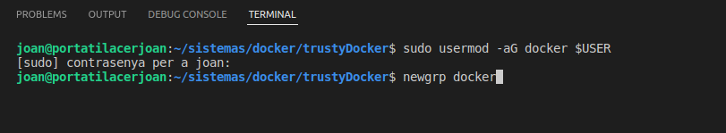
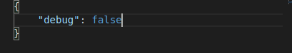
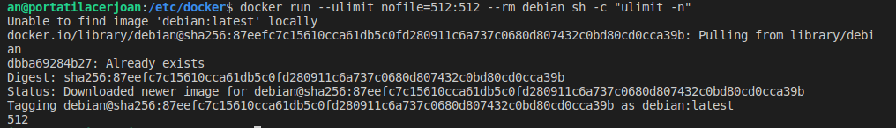
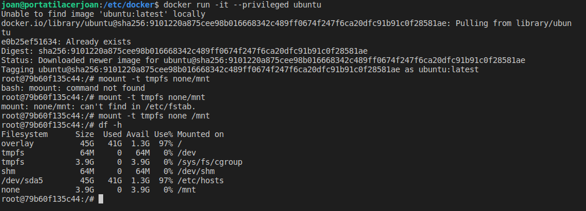

# trustyDocker
this assignment is to learn the basics about docker security

<hr>

### Part 1: Host security

All system software have to be updated to the latest version because the kernel of the host machine is shared.

Before applying host security, a mechanism such as <i>iptables</i>, <i>SElinux</i> or <i>apparmor</i> should be used.

Something super important is to control the permission of the user. It is recommended to create a docker group and add the users with permissions to run containers there.



<hr>

### Part 2: Daemon security

The daemon runs as superuser, so we have to avoid that normal users can modify the configuration and the socket couldn't see it.

the file <i>/etc/docker/daemon.json</i> should be created to configure it:

we have to put debug: false



It's super interesting the <i>icc</i> because it avoids the connectivity between containers due to all they are in the same network but only the ones that are linked are accessible. For example, wordpress and mysql when are linked in a .yml file using docker-compose. 

another important file is the <i>key.json</i>. Any normal user have access because there we can find in 64 base the key to connect via TLS with the registry for example.

<hr>

### Part 3: Containers security

it's where we can find the most activity because they have a lot to configure.

we can use ulimit to limit the resources that a container uses.

``` 
docker run --ulimit nofile=512:512 --rm debian sh -c "ulimit -n" 

```



if we quit the ulimit flag, it takes the default ones. The config file can be modified to fix small limits and modify it in runtime.

Other type of resources can be modified too. For example, in a DDoS attack our container can be out of resources, so we can limit it:

``` 
docker run -it --cpus=".5" ubuntu /bin/bash

```
with this, it will never waste more than half a cpu.

another interesting configuration is to restart when it fails:

```
--restart=on-failure

```

##### privileges:

by default, the user is root

we can change the user at runtime with the flag <i>-u uuid</i>

for example: if we run the following command with this user it will say that there's no access rights

``` 
docker run -u 4400 alpine ls/root

ls: can't open '/root': Permission denied

```

another flag related to privileges is  --privileged

``` 
docker run -it --privileged ubuntu

mount -t tmpfs none /mnt

df -h
```



and it says it has been capable to mount it, but if we don't add privileges, it will return:

```
mount: /mnt: permission denied.
```

the one that has privileges inherits all capabilities of linux

Another thing is to mount the socket of docker in a container. For example, up a container inside another container. This is used a lot in CI/CD practices.

ex:

```
docker run -v /var/run/docker.sock:/var/run/docker.sock -it docker
```
having a docker inside a docker is the same execution because the share the socket.

<hr>

### Part 4: images security

Is more trusty an image that i have access to the dockerfile than another that is already built. It can contain malware.

With docker commit we can create images, but is use is not recommended.

We have to pull only official images or verified. If not, we can be in a hurry.

An image can be done from Github, cloning it or doing the build from the dockerfile.

Docker uses Notary service to manage images nad sign them.

Esta variable de entorno es muy aconsejable tenerla a true. Por ejemplo se puede incluir en el bash.rc.

A partir de una imagen es parecido a compilar a partir de la definición para generar las capas y guardarla en un registry como docker.hub

La imagen de alpine sólo pesa 5.61 MB porque comparte el kernel con el host.

Los comandos se ejecutan en tiempo de compilación en la preparación del entorno y ENTRYPOINT y CMD en tiempo de ejecución.

Lo normal es poner en ENTRYPOINT un comando y en CMD los parámetros (que se pueden sobrescribir)

También existe el comando ADD que es muy parecido a COPY. La diferencia es que COPY sólo permite copiar desde el equipo y ADD desde una url.

Y otra diferencia es que ADD puede copiar y descomprimir archivos, pero la capa no se podrá cachear.

Es una mala praxis no usar la versión al utilizar un paquete. Por ejemplo, alpine

para buscar imágenes se usa docker search alpine, pero no nos muestra tag

De esta forma, se puede comprobar si tiene vulnerabilidades o si dentro de un tiempo la vuelvo a generar puede dar problemas de compatibilidad.

Es bastante normal que el código deba estar compilado lo que añade más superficie a ser atacada porque no interesa tener un compilador en la imagen ya que si nuestro contenedor es atacado el atacante podría compilar programas en nuestro sistema, cosa que está totalmente prohibida.

por ejemplo:

```
FROM golang:alpine AS builder
ENV GO111MODULE=auto
COPY whoami.go /app/
WORKDIR /app
RUN go build -o whoami

FROM alpine
WORKDIR /app
COPY --from=builder /app/whoami /app/
ENTRYPOINT ./whoami
```

pot: concept from kubernetes related to a group of containers that share the same ports space.

Reto: dockerfile en Github y conectarlo a dockerhub para generar un build cada vez que se modifica.

Escaneo pasivo de vulnerabilidades con trivy (alternativa gratuita)

p2: testeo de una imagen de wordpress (que no use tags recientes para que tenga vulnerabilidades)

more info: <a href="https://cheatsheetseries.owasp.org/cheatsheets/Docker_Security_Cheat_Sheet.html">docker security cheat sheet</a>

